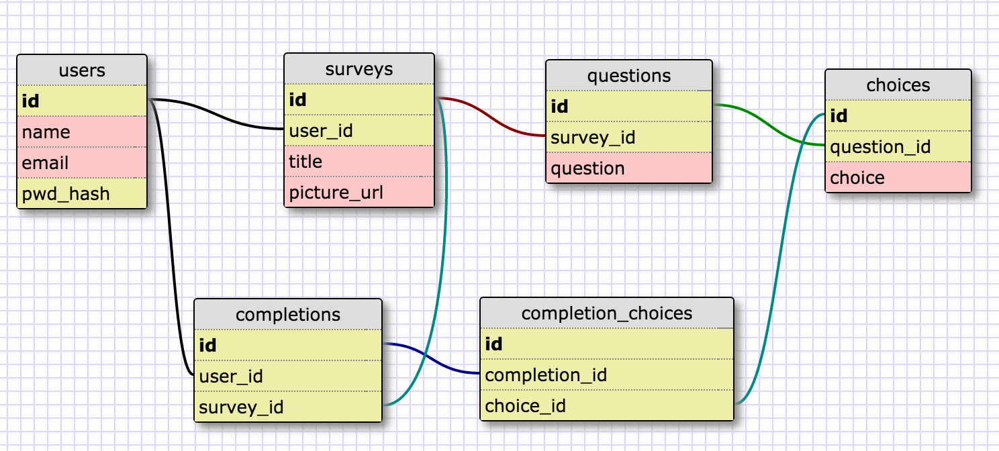

# Survey-Primate
Group project for DBC

# Team name: Krypton

# Team members
- Ace Burgess 
- Doraly Pantaleon
- Alex Taber
- Brendan Miranda

# MVP Description
We're going to build a survey application that lets users create their own multiple-choice polls and other users to vote in them.

This is going to use a combination of pure JavaScript and AJAX to achieve the desired effects.

A survey will have many questions. Each question will have many possible responses. A voter will select one (and only one) response for each question in a survey.

# Schema

# Team dynamic and git workflow.
- Doraly - Git/Skeleton Master
- Ace - Ajax Master
- Brendan - CSS Master

